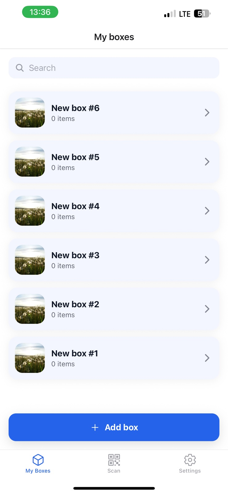
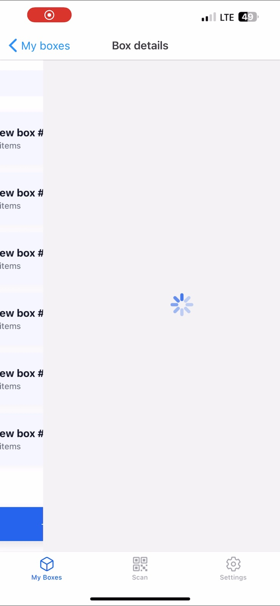
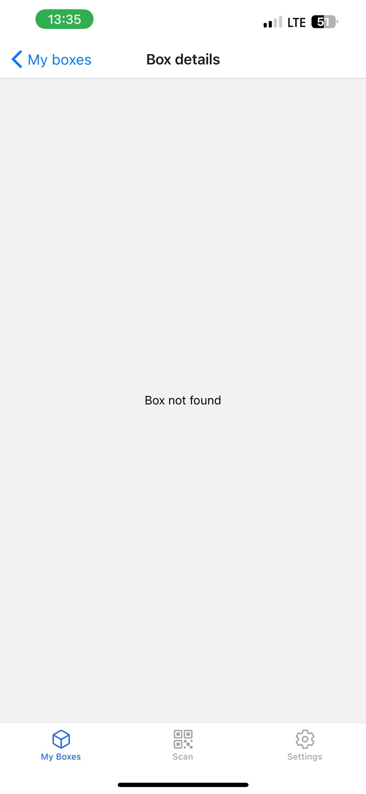

# 📦 Boxes App
- Завантаження даних з **MockAPI**  
- Перехід до деталей боксу  
- Індикатор завантаження при переході  
- Обробку випадку, коли `id` некоректний  

---
*Завантаження з сервера*  

📷 *індикатор завантаження*  

📷 *Обробка невірного айді*  

